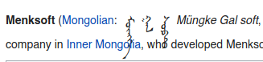

Universal Ricing
================

This is my list of configuration files for \*NIX OS's.  I primarily use
GNU/Linux (Void, if you are interested.)

Now most people would not be interested, but if you are now like me, seeing a
base may help.  Slowly, I am trying to add comments to my dot files, etc. to
explain them.

TABLE OF CONTENTS
-----------------

+ [Directory Structure I am Using](##layout)

+ [LaTeX template and relevant shell-script](##tex-template)

+ [My custom keyboard layouts](##"linguist's-dvorak")

+ [List of Proprietary Fonts and Open Source Copycats](##font-alternatives)

## TEX-TEMPLATE

I have gotten tired of having to retype `*.tex`'s from scratch.  As such, I have
written a new script and included my templates in `Templates/LaTeX`.

Basically, the script will check to see if these files exist:

1. `~/Documents/Assets/LaTeX/Templates`
   (my personal Templates directory)

--OR--

2. `~/Template/LaTeX`

If either does not exist, the program will tell you that, but do nothing about
it (I opted to have it do nothing, as I move my documents manually.)

In order for the script to work right, you should perform either:

* `mkdir -p ~/Templates/LaTeX && cp Template/LaTeX/\* ~/Templates/`

--OR--

* `mkdir -p ~/Documents/Assets/LaTeX/Templates && cp Template/LaTeX/\* ~/Documents/Assets/LaTeX/Templates/`

Basically, the way it works: `textemp [option]`.

You navigate to a new directory you want to start a `*.tex` file in, and tell it
whether you want an article or book.

It will then copy the appropriate file into the PWD as `main.tex` and command
your `$EDITOR` to open it, immediately.

In the case of a book, it will also create a simple hierarchy that **\*I\*** use
with `\subfiles`, putting also a file called `preface.tex` into the place I do.

The hierarchy is thusly:

    ./
     | - main.tex
     \ - usr/.
            \ - local/.
	           | - etc/.
		   |      \- preface.tex
		   |
		   | - graphics/
		   \ - chapters/

## Layout

In short, I am trying to follow the UNIX philosophy as closely as possible in
the layout--for instance, cleaning out the `/home` directory.  Because of this,
I am also moving to other programs that respect the
[XDG Base Directory specification](https://specifications.freedesktop.org/basedir-spec/basedir-spec-latest.html).

So, instead of `xorg-xinit` (*'startx'*,) I am using `sx`.\
Vim--nvim.\
Bash--zsh.\
Etc.\
But, I am also trying to remap all the old stuff as well, so...\

Incomplete, rough Guide:

    $HOME
     |
     |---/.zshenv          #forces remapping of $ZSHDOTDIR
     |
     |---/.bash_profile    #sources from $HOME/.config/bash/.bashrc
     |
     |---/.config
     |     |
     |     |---+/nvim
     |     |---+/sx
     |     \---+/zsh
     |
     \---/.local
           |
           |---+/bin       #shell scripts, etc.
           |
           \---+/profile   #for things I want in across shells
                  |
                  |---+/aliases    #For aliases, such as ls='ls -a'
                  \---+/vars       #For variables custom and ENV, i.e. EDITOR=NVIM

## "Linguist's Dvorak"

Now, this one is rather interesting.  I have always made my own keyboard
layouts, and this is no exception.  I recently switched to Dvorak and am doing
things my own way, as the usual US international layout and its Dvorak
counterpart are backward.  To mediate, rather than modifying the existing
`prefix/X11/xkb/symbols/us` layout, then modifying the `/../rules/evdev.xml` on
every system, I am opting rather to maintain my own, proper layout, that I can
extend, and it will never change, unlike the base XKB files might, therefore
creating conflict.

I shall no longer be maintaining any of these for normal US QWERTY layout, as I
am never going back, and I doubt I shall switch to to Colemak.  If you want
them, I opologise, but you will simply ***have*** to modify it for QWERTY.
However, I will be maintaining an Altai keyboard layout, true to the basic
Russian layout, in my
[Open Oirot](https://gitlab.com/Matthew-Tate-Scarbrough/openoirotproject/)
passion project.

That said, if I get bored, I will probably write a `sed` script to automatically
replace all of the key names in the `symbols/lingdvorak` file to their QWERTY
counter-parts.

Now, to use it, you have to copy `keyboards/lingdvorak` to
`prefix/X11/xkb/symbols/lingdvorak`.

Arch Example:

    sudo cp ~/universalricing/keyboards/lingdvorak /usr/share/X11/xkb/symbols/

Then you must add the following to `prefix/X11/xkb/rules/evdev.xml` after the
tag `<layoutList>`, then reboot or perform `sudo dpkg-reconfigure xkb-data`:

    <layout>
      <configItem>
        <name>lingdvorak</name>
        <!-- Keyboard indicator for English layouts -->
        <shortDescription>lingdv</shortDescription>
        <description>Linguist's Dvorak (US)</description>
        <languageList>
          <iso639Id>eng</iso639Id>
        </languageList>
      </configItem>
      <variantList>
        <variant>
          <configItem>
            <name>alt</name>
            <!-- Keyboard Indicator for Southern Altai layouts -->
            <shortDescription>dv(alt)</shortDescription>
            <description>Southern Altai (Dvorak)</description>
            <languageList>
              <iso639Id>alt</iso639Id>
            </languageList>
          </configItem>
        </variant>
      </variantList>
    </layout>

**NOTE:** This is an excerpt--the most uptodate version will be at the top of
the Ling Dvorak symbols file

## Font Alternatives

**Serif Fonts**

+ Times New Romas (Times)
  - Liberation Serif
  - [FreeSerif](https://www.fontsquirrel.com/fonts/gnu-free-font)
    (closest of the lot)
+ Gentium
  - [Linux Libertine](https://www.fontsquirrel.com/fonts/Linux-Libertine)
    * [Linux Biolinum](https://www.fontsquirrel.com/fonts/linux-biolinum)
      for a matching *sans* font.

*Courier Fonts*

+ Courier Final Draft (Courier)
  - [Adobe Courier](https://fonts.adobe.com/fonts/courier)
  - [Courier Prime](https://quoteunquoteapps.com/courierprime/)
  - [FreeMono](https://www.fontsquirrel.com/fonts/gnu-free-font)
    * FreeMono looks the most like a “typewriter” of the lot
    * FreeMono also supports all European languages,
      supporting over 10.4k glyphs

**Sans Fonts**

+ Helvetica
  - [Swansea](https://www.fontspace.com/swansea-font-f5873)
    * Swansea is public domain
+ San Francisco
  - [Fira Sans](https://www.fontsquirrel.com/fonts/list/foundry/mozilla)

**Old English (Anglo-Saxon) Fonts**

Peter S. Baker has made freely available fonts that _**carefully**_ clone the
scripts used by the Anglo Saxons.

See them here: <https://www.fontspace.com/old-english-fonts-f9479>

**Mongolian Fonts**

The traditional Mongolian writing system is poorly supported, due to its
vertical nature.  Menksoft has made some lovely fonts that work well with the
traditional Mongolian script, even if a webpage does not

At the present time, I do not feel like doing a direct link to their proprietary
fonts' download button(s) (as you have to download them one-by-one.)  I trust
that if you care, you can find a way on this, but the website is
[here](www.menksoft.com).

On a side note, if anyone is interested in developing open source traditional
Mongolian fonts, hit me up, as I would like to help!
